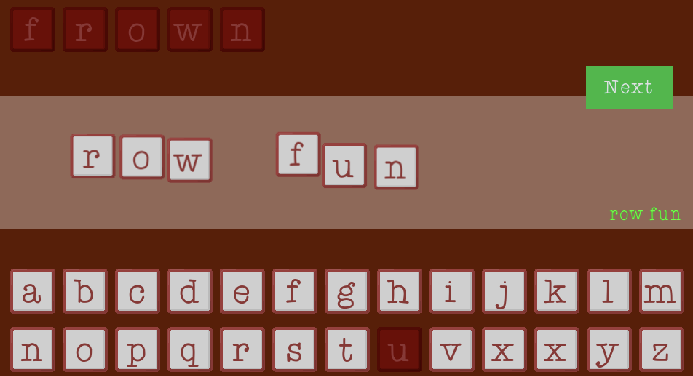

## Concept

Drag the letters from the top row to arrange the word.
You don't have to use all the letters, but you'll get more points if you do.

You'll get more points for anagrams, just using the top letters, longer words, and so on.
It's a multiplier so you can combo up for 100s of points.

Each round the length of the word will increase.

## Development

My entry to the [Brackeys Game Jam 2026.1](https://itch.io/jam/brackeys-15).

The theme was **Strange Places**, so my interpretation here is a bit loose!

<!-- Read the [Dev Log](/posts/estranged-places-devlog). -->

## Postmortem

Of all the candidate themes, this was my least favourite.
Perhaps that's a signal that should really shouldn't put too much thought into the jam before it starts.
In this case, the themes were available for voting and I spent a little time considering what my entry would be for each.

I managed about 4 evenings of work and needed to publish Friday, when in theory there were two full days left.
At the time I had to submit, I'd got the minimal version, but really it needs another few iterations to polish.

That said, even with the time allowed, the code was easy to put together.
Asset wise this is a very limited game, but it uses Godot resources etc to make it extensible.

The game got some good comments, but didn't rank highly.
I suspect word games appeal to some people, but not at all to others.
However, that's my fault and the comments point out how much more fun it would be with more 'juice'.

This isn't a novel idea, but there's a lot of potential for improvement and for this to be just a fun game.
Adding more combo multipliers and score multipliers in, and some realtime feedback.

The word list is a bit strange.
I had originally envisaged this word list as a stop gap, as scoring mechanism would require more information (e.g. did you replace a verb with a verb, is this word similar to another).

Overall, I don't feel I did this idea the justice it deserved in the execution.
I would like to revisit it, given that the foundations are now in _plaice_.
That would really require a 'commercial angle' perhaps mobile and a lot of consideration of mechanics and polish.
