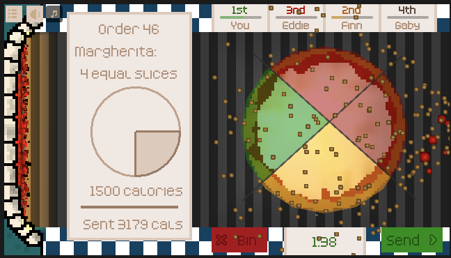

## Concept

You've got to cut that pizza to the number of slices in the Order.

The more evenly sliced, the better - make them as close to the same area as possible!

When you slice:

- Green means the slice is just right
- Orange means the slice is too big (hint maybe slice a bit of crust off?)
- Red means the slice is too small... you might need to Bin this pizza!

When you are happy - if you've got some good slices - **Send** the pizza to bag the calories.

Each game lasts 2 mins and there are several modes:

- Cosy for untimed with no opponents, Cosy ++ if you want more difficultly
- Easy, Normal or Hard for opponents and different numbers of slices

## Development

My entry to the [Foodie Game Jam](https://itch.io/jam/foodie-jam-rpg).

<!-- Read the [Dev Log](/posts/perfect-slice-devlog). -->

## Postmortem

This is my first game jam which was longer than 7 days.
It felt like an enormous amount of time, even working an hour or so each evening.
I actually finished a week early so I could move onto the Godot XR jam.

This was the first jam where I felt I'd made a game rather than just a mechanic or implementation of an idea.
It's nice to have added the polish like the tutorial, different game modes, etc.
I originally thought that in a jam you might be able to skip that, to show promise, but I think the quality bar is now too high to avoid this level of polish.

From previous game jams, I'd realised how important having some form of progression, end state, etc.
I think this is not easy to achieve in a game jam, because it's quite far beyond the core game play loop and time doesn't necessarily allow it.
Adding easy, medium and hard gave players something to do.

The one difficult point I think was the pizza cutting, which is a more difficult problem than it appears:

- If you give the player complete control, they can cut holes in the pizza or cut line which cut themselves
- If you do what the player wants, it's possible they don't cut the crust fully.

There's quite a lot of playtesting needed I think to perfect the slicing mechanics.
And an equal amount of work implementing the code side of self-cutting slices.

I amassed a lot of ideas to extend the game but I did well not to implement them during the jam period.
I don't think the player noticed the changes, but it would have become more and more complex to learn.
This is something that Overcooked also suffers from, where the original had simple mechanics but the various DLC has become increasingly convoluted.

It would be nice to go back and release an update with those changes made.
One commenter suggested multiplayer, which would be an interesting angle to pursue.
