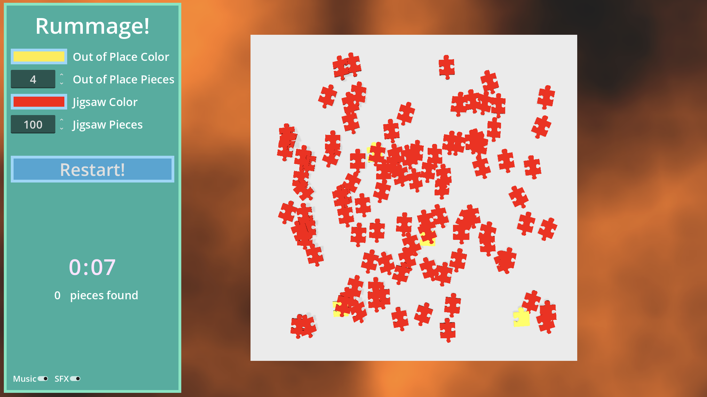

## Concept

Click on jigsaw pieces when you see them, or drag your mouse around to stir things up.

Found them? Make it harder by adding more pieces or making the colors closer.

## Development

My submission to [Queble's Game Jam 2026](https://itch.io/jam/quebles-jam-2026), themed as:

- _'Out of Place'_ to find those different coloured corner jigsaw pieces.
- a tiny touch of _'Timing'_ if you can beat your time.

Read the [Dev Log](/posts/rummage-devlog).

## Postmortem

This was my first game jam and my first time using many of the tools.
I made some choices, such as modelling the pieces in Blender, which I ultimately backtracked on, in that case swapping to Blockbench.

I was able to build an initial prototype on the first evening.
That's largely down to the power of Godot.

The actual game didn't come together until right at the end.
I didn't have a strong design (UI or game play) beyond the jigsaw itself.
As such the colour changing, the difficultly, the placement of the UI, etc wasn't in until I realised I needed to offer difficulty.
In future the 'minimal game loop' and the 'extended game loop' (aka a full run) need to be designed.

I was too stubborn about the lighting and textures - especially given I didn't have a art style of mock up to work towards.
I didn't want the hassle of texturing, particularly the jigsaw pieces.
That would have been complex - at least an extra day which I didn't have in a week long jam.

I also couldn't prevent the jigsaw pieces from leaving the screen.
Originally I had the pieces within a box, but even with various tweaks to the Godot physic engine, they tended to escape.
I probably should have created a mechanic whereby lost pieces are just dropped back in.

I think this could be quite an addictive mobile game.
It would probably benefit from being forced towards a very simple user interface.
