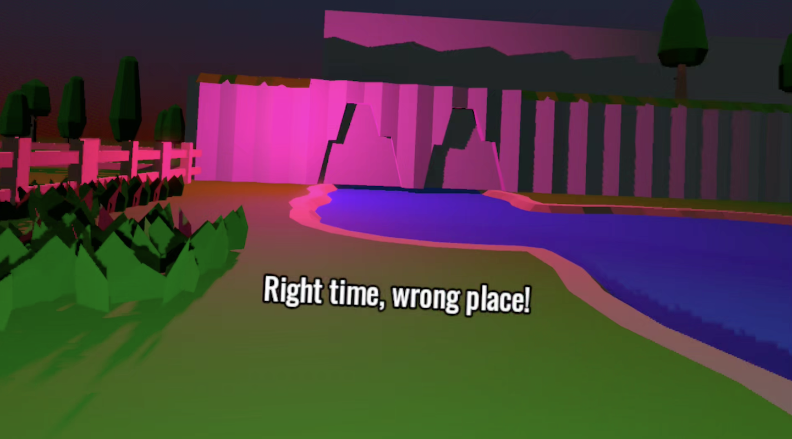

## Concept

Play hide and seek in VR with a magic being...
...but not just by hiding somewhere, also somewhen (... is that a word?):

- Look for the light (especially at night time).
- Look for the right time before searching the map.
- Read for the clues to determine where and when to go.

Teleport to move in space, but A/X and B/Y move in time.

You might want to explore the map first, just to know where things are!

## Development

My entry to the [Godot XR March 2026](https://itch.io/jam/godot-xr-game-jam-mar-2026).

Developed and tested on an Oculus Quest 3.

<!-- Read the [Dev Log](/posts/time-and-seek-devlog). -->

## Postmortem

Godot XR deserved a lot of praise here, especially the godot-xr-tools asset which helps you get set up and provide functionality like the teleport logic.
Without these there's no way an XR game jam could be 7 days long.

This was development up to the deadline.
I had so many small issues on the final day that I uploaded over and over again.
Perhaps this was just more noticeable as it was a little tedious to test in VR, having to take the headset on and off.

My biggest mistake was text.
I cleverly avoided the headset for the first few days prototyping as a standard FPS.
However, the FPS version has nicer looking text clues which didn't translate at all to VR.
Rather than bothering with text clues in VR, I should have just moved to voice clues.
They could have been spatial.

I couldn't stop the player from teleporting beyond the fence.
I tried adding area walls to block this off.
Perhaps I should have created a non-collision terrain so they have nothing to land on?

I really enjoyed hacking up the day/night cycle and the seasons.
They are nowhere near as detailed as others have implemented, but it's very satisfying to see the sun move to the horizon and the sky turn orange.

I strangely enjoyed developing for VR.
Time and Seek could be a full game, after complete redevelopment - the level design would be a huge undertaking.
